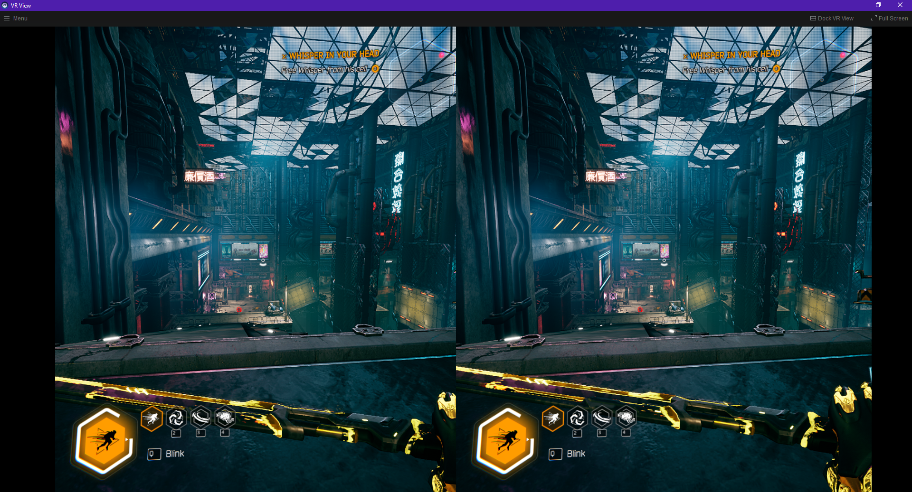

# UnrealVR

**No releases yet**

Adds virtual reality support to flatscreen Unreal Engine games

## Features

- **Stereoscopic Rendering**: Presents the game in full 3D, not a flatscreen in VR
- **6 Degrees of Freedom**: Headset movement and rotation is tracked in-game
- **Configurable Profiles**: Save and share your settings for each game

## Coming Soon

- **Input Binding**: Map VR controller buttons to game actions
- **Controller Tracking**: Link hand movement to in-game objects
- **Synchronized Rendering**: Renders both eyes at the same time, reducing discomfort

## Preview

## Contribute

If you have any ideas for features or want to implement a feature yourself, please email me or send a DM on Discord to
TheNewJavaman#3966.

## Projects

| Project              | Language  | Description                                                                                                                          |
|----------------------|-----------|--------------------------------------------------------------------------------------------------------------------------------------|
| minhook              | C         | By [TsudaKageyu](https://github.com/TsudaKageyu). Allows overriding functions, which are discovered via assembly reverse-engineering |
| PatternStreams       | C++       | Simplifies searching runtime memory in C++ using syntax similar to Java streams                                                      |
| UnrealReflector      | C++       | Exposes core Unreal Engine functionality for running custom actions at runtime                                                       |
| UnrealCameraInjector | C++       | Simplifies injecting one or more custom camera views, and exporting to external render surfaces                                      |
| UnrealVRCore         | C++       | The main logic of the mod, which manages DirectX, OpenXR, and Unreal Engine                                                          |
| UnrealVRLauncher     | C#        | The app UI; this is the only subproject which relies on Visual Studio for development, the rest use CMake/CLion                      |
| docs                 | HTML, CSS | The website ([unrealvr.dev](https://unrealvr.dev))                                                                                   |
### UnrealVRCore Service Structure

#### Service Explanations

| Service  | Description                                                                                  |
|----------|----------------------------------------------------------------------------------------------|
| UnrealVR | Handles mod logic at a high level                                                            |
| Pipe     | Communicates with the app UI (launcher)                                                      |
| Logging  | Flushes the buffered log to the pipe                                                         |
| Graphics | Interacts with D3D11 (and D3D12 in the future)                                               |
| XR       | Interacts with OpenXR                                                                        |
| Engine   | Interacts with the application's game engine (Unreal Engine 4/5, maybe others in the future) |

#### Service Flowchart

<!-- Click on the link to edit the diagram, then update it here -->

[![](https://mermaid.ink/img/pako:eNrNWFtP40YU_isjrxCtxCIKRVR5WAkCoV2xIg0X7UNeJvaJ42bi8Y7HEIr47z1z8X3sJAVVza5I7PnmzDnfnNvMq-fzALyBt7f3Oo0JieJIDoj-Sci-XMAK9gdkf0ZT2D8g1dePVER0xiDF8Vc7gmMBFctvKBLfzilL4aAYmVF_GQqexYGS-Gl-rP7tl-Mxl3CxDIeccaERZ6dn5-cnDcQ9rGUJmetPUwgXAYgSdHL569HpRQVEfcmFQfUBlqEevTo6Oz8dNUc36KExN1EMOWbqfTrSnwqI0RmwC76uWT06Hg5_G7lQm8zSwLpe7SU5TzZAUPXoicqIx9sQmUN7TUijMKasZ00DcCpmMG_qC_-87e1N4xR-ZBD7cBnRUNCVGkqokJEfJTSWZEWjmNCUPMQCKHuckDsQT5EPTZxc4HigkPf615hz1gFNogQUcKy-OzCMhwpyw8MwisMu1Foo0PdOpdCgZBH5qUJd5787sBDjSlqva7oCcmUeC7CCq3gg_AmEZuXAThmQX-gh-QNjnQy50HLtVoLGtWcOyCVj51JSf0F8yhgECqNGPn_5YogcaIE1WWagLi0H30m0JN-DBKlXMPP4GWWaRdU7Ab4kIpzRn44OiP1_eHT6s3EM5MNuX-5MVkap1k2USojJnAvyF5-lOS4Ah54EGdI_7Je1UO2_wz71um6dAd4muF4-qL4r2vyZQQZf-ayDKKdWJS1GfiF2R6LssvrRaGXkVRjy-WpF48DFUm5QB0fo_w6K8K16xq8P40AvlAutMVCZmLvxTqQYLbX8EcvSBZll8zkIBxfWrCYVvSE3syGngnUrN1LoS44hbTdFGQPRk4k9u4HG-NtYZaYc74znRqy-bwtKyrXYmmM6PGanTbCKrkXpTepTCF0X-1HypcAmoWBmTSFNsSS5URMIlbML7HSSTJIF0spApG7wEO3F5_SZJv5CVRUBKc-EDwV-Lep0NNyk1NValaf3Dtvy4bY65USrlM9jfK8MbWvlmvY758uKJQlOgrjQIMf1WtPUztqUO7jTIjPYViyfpNUKVfnCsrbMcWbUesE1yAlayDJZ2VUHxU7ezQblq3XrgStEf4PRRLRWs_r0kVM31JGJdskVx1ieH5JATW9li3KhthX3yCFZKErLIl1wmacK0yfcW7o3Fv5vmYT1f5BBqnvk5HWnLNK04u45kti7DMcPBF6gw4MN5WOewgY_bvqnc8oHeab1Ax_9QFAyun3cFiq4pFUn5kkRnj2TE0Zf8C2NVqWxwbZLMu7THeOmDI_OcKrGTW_UzIqo-T6puWU1c7mS49hkw2boFFmxDJ68Jx-X-fN_E0GlPY3pVfM_IoqunVGki3A2W0VyJGzS6ogH9ERyA3NZFdKsvRdYqLElrUpqlWc8jaDDYuylvb5qgxRNj_E8S9JMzKkPlTisUjfUdbXDhG3q88SsMs8YS30B2Ff_yMrTSbXQKr22KLONNkcz3GGLInYShYteZq-wk6zxWiFt637mnQXu5BD7NZ5oz2c2LTkEOg6hl9A4hAJLESMaMsrDSrOrVus6O2pnT51r6ep0nb2uNX7XU2ujEpXL7tBLTWCFz7qR0pnsX3cvrWbVqc52waBVSir5tR_OgKb9ze17WlVzTnDY0nWoyBXqOQLUJ6hLJ-cJg3SE8yKTAX-OHQeXXc8W-tzqtK44rbrPsI6TdEVsGTUtuWWQtcNsyDAv1xDtG4vOC4ZWqXQuL2sR1L5i-srVQYdzZt-kjSuiPl3qsjdkO-_Aw_YHRwJv4OnL86mnL8mnnrr5DWBOM8xy3jR-Q2imW5SrIJJceANzS-7RTPK7l9j3BlJkkIPsDadFvf0DBTGj1g)](https://mermaid.live/edit#pako:eNrNWFtP40YU_isjrxCtxCIKRVR5WAkCoV2xIg0X7UNeJvaJ42bi8Y7HEIr47z1z8X3sJAVVza5I7PnmzDnfnNvMq-fzALyBt7f3Oo0JieJIDoj-Sci-XMAK9gdkf0ZT2D8g1dePVER0xiDF8Vc7gmMBFctvKBLfzilL4aAYmVF_GQqexYGS-Gl-rP7tl-Mxl3CxDIeccaERZ6dn5-cnDcQ9rGUJmetPUwgXAYgSdHL569HpRQVEfcmFQfUBlqEevTo6Oz8dNUc36KExN1EMOWbqfTrSnwqI0RmwC76uWT06Hg5_G7lQm8zSwLpe7SU5TzZAUPXoicqIx9sQmUN7TUijMKasZ00DcCpmMG_qC_-87e1N4xR-ZBD7cBnRUNCVGkqokJEfJTSWZEWjmNCUPMQCKHuckDsQT5EPTZxc4HigkPf615hz1gFNogQUcKy-OzCMhwpyw8MwisMu1Foo0PdOpdCgZBH5qUJd5787sBDjSlqva7oCcmUeC7CCq3gg_AmEZuXAThmQX-gh-QNjnQy50HLtVoLGtWcOyCVj51JSf0F8yhgECqNGPn_5YogcaIE1WWagLi0H30m0JN-DBKlXMPP4GWWaRdU7Ab4kIpzRn44OiP1_eHT6s3EM5MNuX-5MVkap1k2USojJnAvyF5-lOS4Ah54EGdI_7Je1UO2_wz71um6dAd4muF4-qL4r2vyZQQZf-ayDKKdWJS1GfiF2R6LssvrRaGXkVRjy-WpF48DFUm5QB0fo_w6K8K16xq8P40AvlAutMVCZmLvxTqQYLbX8EcvSBZll8zkIBxfWrCYVvSE3syGngnUrN1LoS44hbTdFGQPRk4k9u4HG-NtYZaYc74znRqy-bwtKyrXYmmM6PGanTbCKrkXpTepTCF0X-1HypcAmoWBmTSFNsSS5URMIlbML7HSSTJIF0spApG7wEO3F5_SZJv5CVRUBKc-EDwV-Lep0NNyk1NValaf3Dtvy4bY65USrlM9jfK8MbWvlmvY758uKJQlOgrjQIMf1WtPUztqUO7jTIjPYViyfpNUKVfnCsrbMcWbUesE1yAlayDJZ2VUHxU7ezQblq3XrgStEf4PRRLRWs_r0kVM31JGJdskVx1ieH5JATW9li3KhthX3yCFZKErLIl1wmacK0yfcW7o3Fv5vmYT1f5BBqnvk5HWnLNK04u45kti7DMcPBF6gw4MN5WOewgY_bvqnc8oHeab1Ax_9QFAyun3cFiq4pFUn5kkRnj2TE0Zf8C2NVqWxwbZLMu7THeOmDI_OcKrGTW_UzIqo-T6puWU1c7mS49hkw2boFFmxDJ68Jx-X-fN_E0GlPY3pVfM_IoqunVGki3A2W0VyJGzS6ogH9ERyA3NZFdKsvRdYqLElrUpqlWc8jaDDYuylvb5qgxRNj_E8S9JMzKkPlTisUjfUdbXDhG3q88SsMs8YS30B2Ff_yMrTSbXQKr22KLONNkcz3GGLInYShYteZq-wk6zxWiFt637mnQXu5BD7NZ5oz2c2LTkEOg6hl9A4hAJLESMaMsrDSrOrVus6O2pnT51r6ep0nb2uNX7XU2ujEpXL7tBLTWCFz7qR0pnsX3cvrWbVqc52waBVSir5tR_OgKb9ze17WlVzTnDY0nWoyBXqOQLUJ6hLJ-cJg3SE8yKTAX-OHQeXXc8W-tzqtK44rbrPsI6TdEVsGTUtuWWQtcNsyDAv1xDtG4vOC4ZWqXQuL2sR1L5i-srVQYdzZt-kjSuiPl3qsjdkO-_Aw_YHRwJv4OnL86mnL8mnnrr5DWBOM8xy3jR-Q2imW5SrIJJceANzS-7RTPK7l9j3BlJkkIPsDadFvf0DBTGj1g)

### Improvements

There are so many features I want to add, and so many refactorings that could improve the code.

- **Input Binding**: Map VR controller buttons to game actions via keyboard/mouse/gamepad input. Add a button to reset
  the view rotation/position.
- **Controller Tracking**: Link hand movement to in-game objects. Make them rotate and move according to how your
  hands move. Allow configurable offsets for the UI so that it feels like your hand is holding a gun, for example.
- **Synchronized Rendering**: Renders both eyes at the same time, reducing discomfort. This one isn't as important
  because the mod seems to perform pretty well so far. But at lower framerates, some people may experience discomfort is
  the positions of objects aren't aligned for the left/right eyes.
- **Optimization**: Do more profiling to increase framerate. VR should be accessible to as many people as possible, so
  we as a community need to make sure that our mods aren't too limited by hardware.
- **VR For All**: Abstract the graphics, VR, and game engine services into interfaces that can be implemented for other
  graphics APIs/VR runtimes/game engines; this will definitely be necessary for D3D12, and if I want to add support
  Vulkan/OpenGL, it'll be even more important. Probably won't be used for other game engines, but if someone uses a game
  engine written in any language that can interop with C++, imagine the possibilities! Probably not useful for VR,
  though, since OpenXR is the future... hopefully there won't ever be a replacement VR runtime that I'll have to add
  support for.
- **UE Version Detector**: Reduces the configuration necessary for new games. Would use the same information as the
  Details pane in File Explorer to determine the Unreal Engine version.
- **Console Output**: Enable/disable the log window; also, don't use a basic terminal for output, show it in the
  nice-looking app UI.
- **Unreal Engine 5**: It's not too different from UE4, so add support to UML if Russell.J doesn't have time
- **Build System**: Use meson so it's faster and cross-platform. Would also reduce dependence on Rider/Visual Studio
- **Stop Using UML**: Build a home-grown solution that's better for this specific use-case
- **Dependency Injection**: Inject service class instances at runtime so there aren't as many static members

### Development Tools

- **Rider 2022.1 EAP**: For writing C++ code; it has a much better code formatter than Visual Studio, is much faster,
  and has superior refactoring capabilities. Also supports Python for the rizin script. Get it for free via the early
  access program in the Jetbrains Toolbox app
- **Visual Studio 2022 Preview**: For writing C# code or HLSL shaders; Rider doesn't support WinUI nor Hot Reload; also,
  VS supports profiling both the CPU and GPU for C++, compiling HLSL, and packaging the final app. Get it for free via
  the Visual Studio installer
- **Sourcetree**: My favorite Git GUI; the main thing is its support for multiple stashes; get it for free from
  Atlassian
- **Rizin**: Used to reverse engineer UE/game binaries. Get it for free from GitHub

### Rizin Cheatsheet

My most-used commands for reverse-engineering game binaries

- `[command]?`: Show the help menu
- `o [filename]`: Open a binary (exe, dll, lib)
- `ipd [filename]`: Open a debug symbols file (pdb)
- `Po [filename]`: Open a project (rzdb)
- `Ps [filename]`: Save project to file (rzdb)
- `aa`: Run quick analysis on the binary (better for no PDB)
- `aaa`: Run longer analysis on the binary (better for PDB, includes function autonaming)
- `aflq~[function]`: Search for a function
- `s [address|function]`: Go to an address or function
- `zaf [function] [signature]`: Create a signature for the current function
- `z`: List signatures
- `zos [filename]`: Save signatures to file (sdb)
- `zj | python rizin_to_uml.py [numbytes]`: Print signatures in UML format; see `rizin_to_uml.py`
